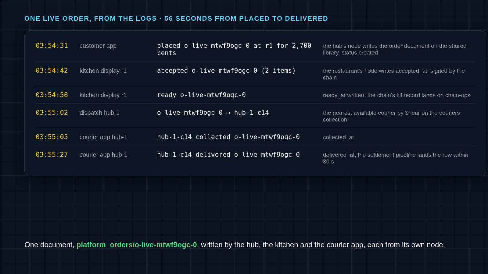
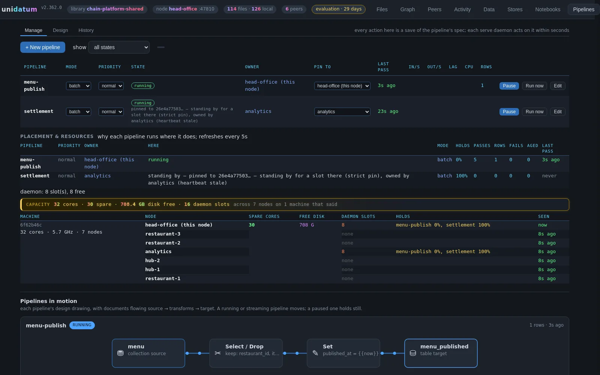
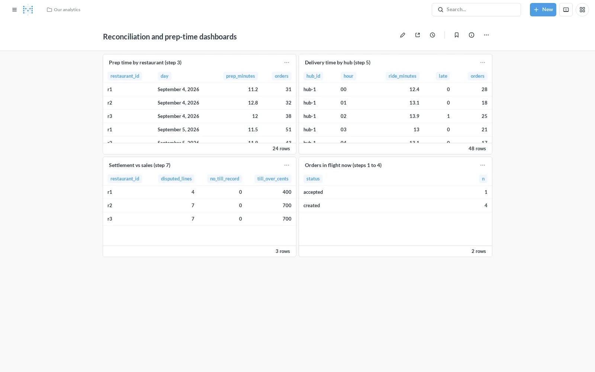
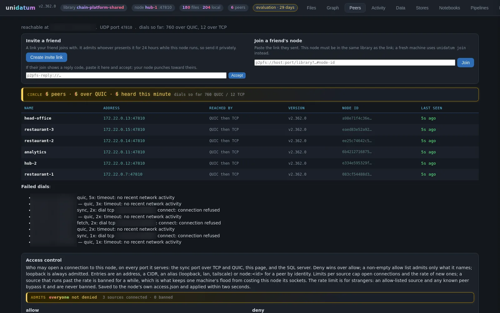
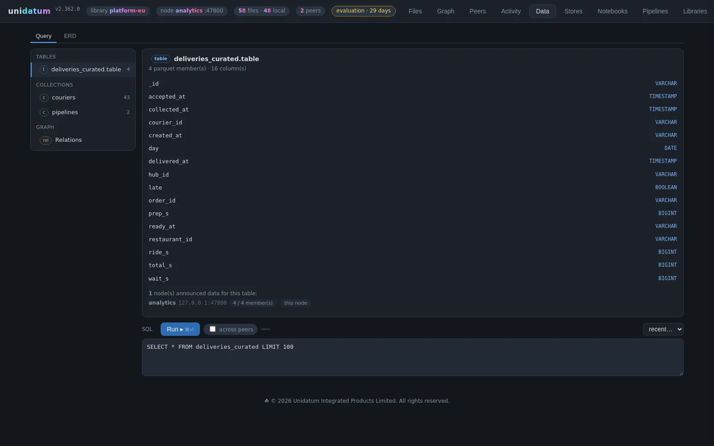

# Kitchen to courier: the MVP, built from the kit

A restaurant chain and a delivery platform meeting in one shared library:
the order is one document both companies write and sign, the menu is
published to the platform every few minutes, the settlement comes back
weekly. This repository is that design built as a demo on one machine,
by Claude Code, from the build kit the Unidatum Design studio produced
for it. The design and the story are in the two posts:

- [Architecture: kitchen to courier](https://www.unidatum.ie/en/blog/architecture-kitchen-to-courier), the design
- [Build it, part 1](https://www.unidatum.ie/en/blog/build-kitchen-to-courier-kit), the kit; part 2 is this repository

**Run it:** put the engine's release archive in this folder, then
`bin/demo-up.sh`. It builds the image, brings up seven nodes, registers
the five jobs, seeds a week of orders, starts the kitchen displays,
dispatch and courier apps, sets up Metabase, places three live orders and
runs the twenty-one checks. `DEMO.md` walks the three processes step by
step. About eight minutes.

| file | what it is |
| --- | --- |
| `DECISIONS.md` | the answers to the kit's open questions, and why |
| `DEMO.md` | the demo script: each process step by step, what to run, where to look |
| `GAPS.md` | where the design and the engine differ, and what was done about it |
| `Dockerfile`, `entrypoint.sh`, `docker-compose.yml` | the engine image, one container per design node (two engine processes where a node joins two libraries), the SQL wires, Metabase, the tools and the simulators |
| `lib/api.mjs` | the engine's HTTP API, the calls the build sheet lists |
| `pipelines/specs.mjs` | the five jobs as engine pipeline specs: menu publish, settlement, order-timeline curation, sales curation, reconciliation |
| `seed/seed.mjs` | a week of orders, three menus, sixty couriers, the chain's till |
| `sims/` | the kitchen display, the hub's dispatch rule, the courier app, the customer app |
| `bin/` | `demo-up.sh`, `hold.mjs` (every writer holds what it writes), `metabase.mjs` |
| `checks/run.mjs` | the twenty-one checks of the MVP sheet |

The kit as delivered is the first commit, and its files are unchanged
below: the contract this was built to.

## Results

From the last run, a fleet built from nothing by `bin/demo-up.sh`, three
live orders placed, twenty-one checks passing (`checks/run.mjs`).

| what the sheet asked | target | measured |
| --- | --- | --- |
| a live order, placed to delivered | | 56 s: accepted 11 s after placing, ready 16 s later, dispatched 4 s after that, collected in 3 s, delivered 22 s on |
| a menu price change live on the platform, signed | 5 minutes | 31 s |
| orders delivered inside the promised time | 95% | 98.3% of 1,009 |
| week close to the chain paid | 9 days | at most 7 days from delivery to the statement row |
| settlement lines the chain disputes | the 2% the seed plants | 27 found (10, 6, 11 across the restaurants), including the six live orders delivered before the kitchen wrote its till record |
| signed publishes verified on the other side | every commit | hub-1 and the head office merged every op, none rejected |
| the four dashboard queries | rows | 24, 48, 3 and 2 rows |

The pipelines page of the head office's node on the shared library: the
menu publish running here, the settlement pinned to the analytics node,
placement across the seven nodes, and the pipeline drawn in motion.

Metabase over the PostgreSQL wires: prep time by restaurant and delivery
time by hub from the analytics node, settlement against sales from the
head office, orders in flight from hub-1.

The shared library from hub-1's node: six peers, all reached over QUIC,
the platform's and the chain's nodes in one circle.

`deliveries_curated` on the analytics node: sixteen columns landed by the
curate pipeline from the shared orders, prep, wait and ride times in
seconds, and whether the order was late.

---

# Kitchen to courier: a chain and a platform on one shared library: build kit

This folder is everything Claude Code needs to build a demo of this design on one machine.

1. Put the Unidatum release archive in this folder: `unidatum-<version>-linux-amd64.tar.gz` (or the zip), from your evaluation licence at https://www.unidatum.ie/en/pricing#evaluation.
2. Open this folder in Claude Code.
3. Say: **build it**.

Claude Code reads `CLAUDE.md`, asks the open questions once, and builds the MVP sheet section by section, one commit per section, with the checks as the tests and the demo script as the README of the repo it makes.

| File | What it is |
| --- | --- |
| `CLAUDE.md` | The prompt for the MVP on one machine with docker-compose |
| `CLAUDE-FULL.md` | The prompt for the real deployment, for later |
| `design.json` | The design, every level and the process view; open it in the studio at https://www.unidatum.ie/en/architect with Load JSON |
| `BUILD-SHEET.md` | The runbook for the real deployment |
| `MVP-SHEET.md` | The same design on one machine: services, scale, seed data, the demo script, the checks |
| `docker-compose.yml` | The draft from the MVP sheet, to edit |
| `checks/` | One stub per check in the MVP sheet |

Made by the Unidatum Design studio. Unidatum Integrated Products Limited, Ireland.
